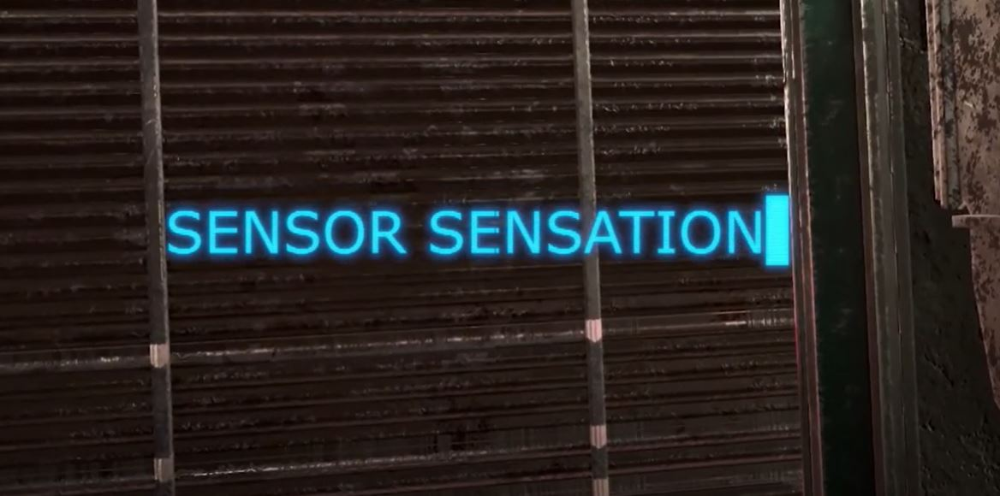
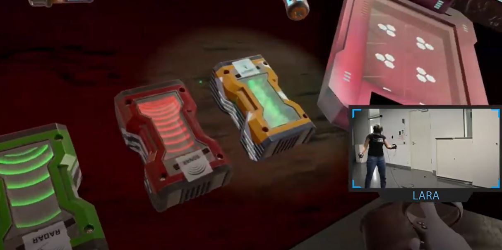
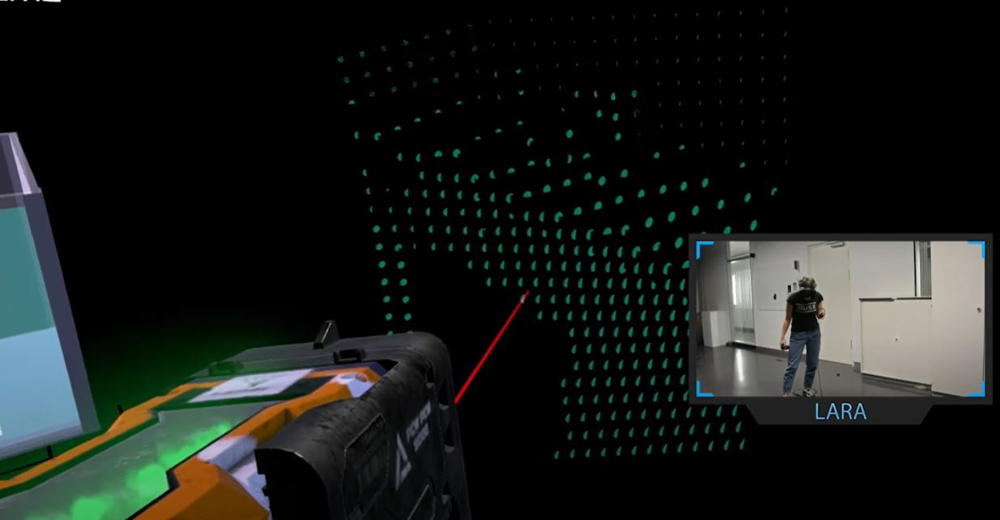

# Immersive Media and Robotics

#### Project Scope
_______________
:mortar_board: The project was created as an interdisciplinary project between the _Oregon State University_ in Corvallis, Oregon and the _University of Applied Science and Media, Stuttgart_ in Stuttgart, Germany.

#### Project Idea
__________________
:robot: The goal of the project was to gamify the interaction with modern, current sensors in a scenario of _autonomous vehicles_ in order to understand not only limitations, but also the use of those.

#### Game Play
_____________________

 :video_game: In the context of the interdisciplinary project "Immersive Media for Robotics" conception and implementation of a virtual reality app, which is to create added value in the field of robotics through a tangible transfer of knowledge. Thereby the users should be sensitized for the image processing of sensors (e.g. proximity switch, radar, LiDar, depth camera etc.), as well as the corresponding facts and develop an understanding for limitations and technology. By means of gameification, these limitations can be illustrated to the different target groups in a playful way.

